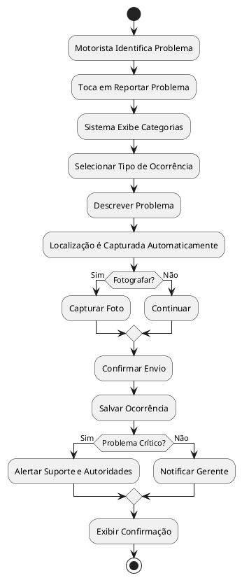
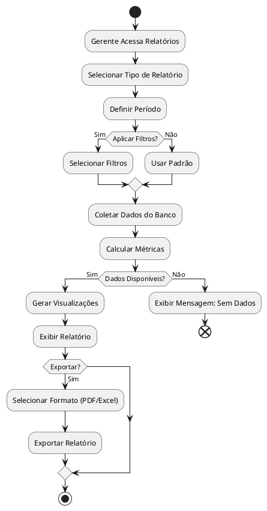
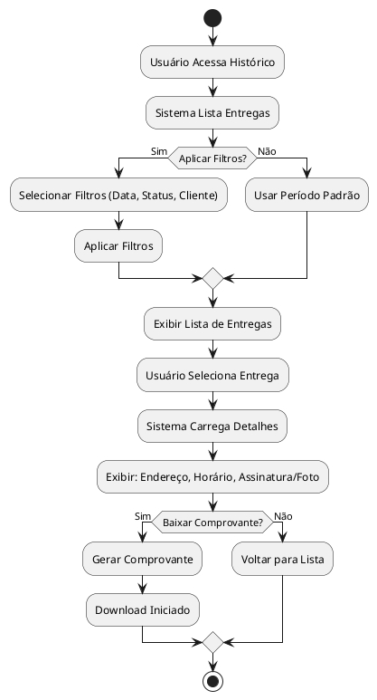
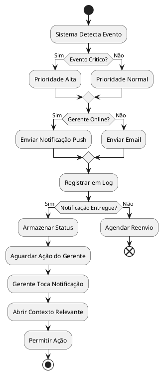
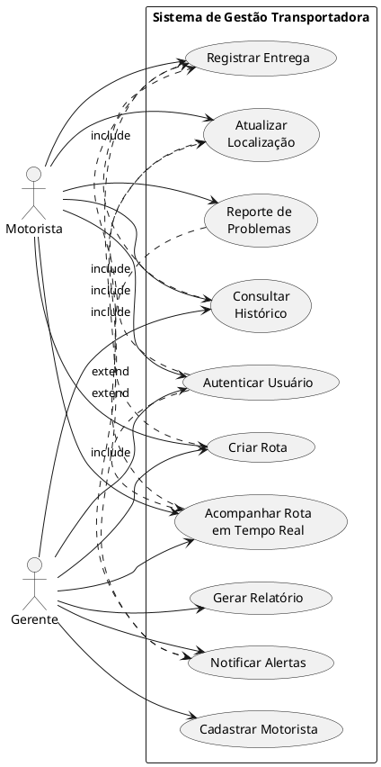

# 📋 Documentação dos Casos de Uso - Sistema de Gestão para Transportadora

---

## UC01 — Autenticar Usuário

**Ator(es):** Motorista, Gerente

**Descrição:** O usuário realiza login no sistema utilizando credenciais (email/senha ou biometria) para acessar a aplicação conforme seu perfil.

**Pré-condições:**
- O usuário possui uma conta criada no sistema
- O servidor está disponível
- O dispositivo tem conexão com internet

**Pós-condições:**
- O usuário está autenticado no sistema
- O dashboard apropriado é exibido conforme o perfil (Motorista ou Gerente)
- Token de sessão é gerado

**Fluxo Principal:**
1. Usuário abre a aplicação
2. Sistema exibe tela de login
3. Usuário insere email/senha
4. Sistema valida as credenciais no banco de dados
5. Sistema autentica o usuário
6. Sistema redireciona para o dashboard correspondente

**Fluxos Alternativos / Exceções:**
- **FA01 — Credenciais Inválidas:** Se email ou senha estiverem incorretos, sistema exibe mensagem de erro e permite nova tentativa
- **FA02 — Autenticação Biométrica:** Se o dispositivo suportar, usuário pode optar por biometria (impressão digital/reconhecimento facial)
- **FA03 — Falha de Conectividade:** Se não houver conexão, sistema exibe mensagem e tenta reconectar automaticamente

**Relacionamentos:**
- Include: Validação de Credenciais
- Extend: Autenticação Biométrica

**Diagrama de Atividades:**


---

## UC02 — Cadastrar Motorista

**Ator(es):** Gerente

**Descrição:** O gerente registra um novo motorista no sistema, incluindo dados pessoais, documentação e veículo associado.

**Pré-condições:**
- Gerente está autenticado no sistema
- Dados do motorista estão disponíveis
- Motorista possui CNH válida

**Pós-condições:**
- Motorista foi cadastrado no sistema
- Conta de acesso foi criada para o motorista
- Email de confirmação foi enviado

**Fluxo Principal:**
1. Gerente acessa seção "Cadastro de Motoristas"
2. Clica em "Novo Motorista"
3. Sistema exibe formulário de cadastro
4. Gerente preenche dados pessoais (nome, CPF, telefone)
5. Gerente insere dados da CNH (número, validade)
6. Gerente associa um veículo
7. Gerente confirma cadastro
8. Sistema envia email de boas-vindas ao motorista

**Fluxos Alternativos / Exceções:**
- **FA01 — CPF Duplicado:** Se CPF já existe, sistema avisa e não permite o cadastro
- **FA02 — CNH Vencida:** Sistema valida data de validade e exibe aviso se necessário
- **FA03 — Erro de Conexão:** Dados são salvos localmente e sincronizados quando reconectar

**Relacionamentos:**
- Include: Validação de Documentos, Associar Veículo
- Extend: Envio de Email

**Diagrama de Atividades:**


---

## UC03 — Criar Rota de Entrega

**Ator(es):** Gerente

**Descrição:** O gerente cria uma nova rota especificando pontos de entrega, motorista responsável e data de execução.

**Pré-condições:**
- Gerente está autenticado
- Pelo menos um motorista cadastrado
- Pontos de entrega estão identificados

**Pós-condições:**
- Rota foi criada no sistema
- Motorista recebeu notificação da nova rota
- Rota aparece no dashboard do motorista

**Fluxo Principal:**
1. Gerente acessa "Gerenciar Rotas"
2. Clica em "Nova Rota"
3. Sistema exibe formulário de criação
4. Gerente insere data da rota
5. Gerente seleciona motorista responsável
6. Gerente adiciona pontos de entrega (endereço, cliente, peso)
7. Sistema calcula distância e tempo estimado
8. Gerente confirma criação
9. Sistema notifica o motorista

**Fluxos Alternativos / Exceções:**
- **FA01 — Motorista Indisponível:** Se motorista já tem rota, sistema sugere outro
- **FA02 — Erro ao Calcular Rota:** Se falha no cálculo, sistema exibe erro e permite ajustes manuais
- **FA03 — Rota Duplicada:** Sistema valida se não há outra rota idêntica

**Relacionamentos:**
- Include: Associar Motorista, Calcular Rota, Notificar Motorista
- Extend: Otimizar Rota

**Diagrama de Atividades:**


---

## UC04 — Acompanhar Rota em Tempo Real

**Ator(es):** Gerente, Motorista

**Descrição:** O gerente monitora a localização e progresso da rota em tempo real, enquanto o motorista visualiza sua posição na rota.

**Pré-condições:**
- Rota foi criada e atribuída
- Motorista iniciou a rota
- GPS está ativado no dispositivo do motorista
- Conexão de internet ativa

**Pós-condições:**
- Posição do motorista é atualizada em tempo real
- Gerente recebe alertas de desvios ou atrasos
- Histórico de rota é registrado

**Fluxo Principal:**
1. Motorista inicia a rota no aplicativo
2. Sistema ativa o rastreamento por GPS
3. Localização é enviada ao servidor a cada 30 segundos
4. Gerente visualiza mapa com motorista em tempo real
5. Motorista vê sua localização e próximo ponto de entrega
6. Conforme motorista se aproxima, sistema alerta
7. Motorista chega ao ponto de entrega
8. Motorista confirma chegada

**Fluxos Alternativos / Exceções:**
- **FA01 — Perda de Sinal GPS:** Sistema continua com última localização conhecida e tenta reconectar
- **FA02 — Desvio de Rota:** Sistema alerta gerente se motorista se afastar significativamente
- **FA03 — Internet Instável:** Dados são sincronizados quando conexão normalizar

**Relacionamentos:**
- Include: Obter Localização GPS, Enviar Notificação
- Extend: Alerta de Desvio

**Diagrama de Atividades:**


---

## UC05 — Registrar Entrega

**Ator(es):** Motorista

**Descrição:** O motorista confirma a entrega de uma encomenda no ponto de destino, registrando assinatura digital ou foto como comprovante.

**Pré-condições:**
- Motorista está no ponto de entrega
- Encomenda está disponível
- Receptor está presente ou indicado

**Pós-condições:**
- Entrega foi confirmada no sistema
- Comprovante foi armazenado
- Status de entrega foi atualizado
- Cliente recebeu notificação

**Fluxo Principal:**
1. Motorista chega ao ponto de entrega
2. Sistema exibe detalhes da encomenda
3. Motorista verifica o pacote
4. Motorista solicita assinatura do receptor
5. Sistema captura assinatura digital
6. Motorista tira foto do pacote/local (opcional)
7. Motorista confirma entrega
8. Sistema atualiza status para "Entregue"
9. Cliente recebe notificação de entrega

**Fluxos Alternativos / Exceções:**
- **FA01 — Receptor Não Encontrado:** Motorista registra tentativa e agenda nova data
- **FA02 — Recusa de Entrega:** Motorista registra motivo e retorna com encomenda
- **FA03 — Dano Detectado:** Motorista fotografa e relata dano antes de entregar
- **FA04 — Assinatura Digital Falha:** Permite captura de foto como alternativa

**Relacionamentos:**
- Include: Capturar Assinatura, Notificar Cliente
- Extend: Fotografar Evidência

**Diagrama de Atividades:**
```plantuml
@startuml UC05_Registrar_Entrega
start
:Motorista Chega no Ponto;
:Sistema Exibe Detalhes;
:Verificar Pacote;
if (Pacote Integro?) then (Sim)
  :Solicitar Assinatura;
  if (Obter Assinatura) then (Sucesso)
    :Capturar Assinatura Digital;
  else (Falha)
    :Fotografar Pacote;
  endif
  :Confirmar Entrega;
  :Atualizar Status para Entregue;
  :Notificar Cliente;
  stop
else (Danificado)
  :Fotografar Dano;
  :Relatar Incidente;
  :Retornar Pacote;
  end
endif
@enduml
```

---

## UC06 — Reporte de Problemas/Ocorrências

**Ator(es):** Motorista

**Descrição:** O motorista registra problemas encontrados durante a rota (acidente, avaria do veículo, trânsito intenso, etc.) para notificação imediata do gerente.

**Pré-condições:**
- Motorista está em rota
- Problema foi identificado
- Dispositivo tem conexão

**Pós-condições:**
- Ocorrência foi registrada no sistema
- Gerente foi notificado
- Assistência pode ser acionada se necessário
- Registro fica no histórico

**Fluxo Principal:**
1. Motorista identifica um problema
2. Motorista toca em "Reportar Problema" no app
3. Sistema exibe categorias de ocorrências
4. Motorista seleciona tipo (acidente, avaria, trânsito, etc.)
5. Motorista insere descrição e localização
6. Motorista fotografa (opcional)
7. Motorista confirma envio
8. Sistema notifica gerente em tempo real
9. Gerente visualiza ocorrência no dashboard

**Fluxos Alternativos / Exceções:**
- **FA01 — Problema Crítico (Acidente):** Sistema escalona para suporte e autoridades automaticamente
- **FA02 — Internet Indisponível:** Ocorrência é salva localmente e enviada quando reconectar
- **FA03 — Foto Não Capturada:** Permite apenas descrição textual

**Relacionamentos:**
- Include: Localizar Motorista, Notificar Gerente
- Extend: Alertar Suporte/Autoridades

**Diagrama de Atividades:**


---

## UC07 — Gerar Relatório de Atividades

**Ator(es):** Gerente

**Descrição:** O gerente gera relatórios detalhados sobre atividades de rotas, motoristas e entregas para análise operacional e tomada de decisão.

**Pré-condições:**
- Gerente está autenticado
- Há dados de rotas e entregas registrados
- Período de relatório está definido

**Pós-condições:**
- Relatório foi gerado
- Relatório pode ser exportado (PDF/Excel)
- Relatório fica armazenado no sistema

**Fluxo Principal:**
1. Gerente acessa "Relatórios"
2. Seleciona tipo de relatório (Rotas, Motoristas, Entregas, Financeiro)
3. Define período (data início e fim)
4. Gerente aplica filtros (motorista, veículo, status)
5. Sistema coleta dados do banco
6. Sistema calcula métricas (km rodado, tempo, taxa de sucesso)
7. Sistema gera visualizações (gráficos, tabelas)
8. Gerente visualiza relatório
9. Gerente pode exportar em PDF ou Excel

**Fluxos Alternativos / Exceções:**
- **FA01 — Sem Dados no Período:** Sistema exibe mensagem e permite ajustes de período
- **FA02 — Relatório Muito Grande:** Sistema oferece paginação ou divisão por semana
- **FA03 — Erro ao Gerar:** Sistema tenta novamente e notifica se falhar

**Relacionamentos:**
- Include: Filtrar Dados, Calcular Métricas, Exportar
- Extend: Gráficos Avançados

**Diagrama de Atividades:**


---

## UC08 — Atualizar Localização em Tempo Real

**Ator(es):** Motorista, Sistema

**Descrição:** O sistema captura e atualiza continuamente a localização do motorista durante a rota, enviando para o servidor a intervalos regulares.

**Pré-condições:**
- Rota foi iniciada
- GPS está ativado
- Conexão de internet está ativa
- Permissão de localização foi concedida

**Pós-condições:**
- Localização foi atualizada no servidor
- Informação fica disponível para o gerente
- Histórico de rota foi registrado

**Fluxo Principal:**
1. Motorista inicia rota
2. Sistema solicita permissão de GPS (primeira vez)
3. Sistema inicia serviço de localização em background
4. GPS captura coordenadas (latitude, longitude)
5. Sistema envia coordenadas ao servidor a cada 30 segundos
6. Servidor armazena no banco de dados
7. Mapa atualiza com posição em tempo real
8. Histórico de rota é construído

**Fluxos Alternativos / Exceções:**
- **FA01 — GPS Desativado:** Sistema alerta motorista e pausar sincronização
- **FA02 — Sem Internet:** Dados são armazenados localmente e sincronizados depois
- **FA03 — Bateria Baixa:** Sistema oferece modo econômico (atualizar menos frequentemente)

**Relacionamentos:**
- Include: Capturar GPS, Sincronizar com Servidor
- Extend: Modo Econômico de Bateria

**Diagrama de Atividades:**
```plantuml
@startuml UC08_Atualizar_Localizacao
start
:Motorista Inicia Rota;
:Solicitar Permissão de GPS;
if (Permissão Concedida?) then (Sim)
  :Ativar Serviço de Localização;
  repeat
    :Capturar Coordenadas GPS;
    if (Conexão Internet?) then (Ativa)
      :Enviar para Servidor;
      :Servidor Armazena;
    else (Inativa)
      :Armazenar Localmente;
    endif
    :Atualizar Mapa;
    :Registrar no Histórico;
    if (Bateria Baixa?) then (Sim)
      :Ativar Modo Econômico;
    endif
    :Aguardar 30 Segundos;
  until (Rota Finalizada?)
    :Sincronizar Dados Pendentes;
    stop
else (Negada)
  :Exibir Alerta: GPS Necessário;
  end
endif
@enduml
```

---

## UC09 — Consultar Histórico de Entregas

**Ator(es):** Motorista, Gerente

**Descrição:** O usuário consulta o histórico de entregas passadas, visualizando detalhes, status, datas e comprovantes.

**Pré-condições:**
- Usuário está autenticado
- Há entregas registradas no sistema
- Período ou filtros podem ser aplicados

**Pós-condições:**
- Histórico foi exibido
- Detalhes de entregas foram acessados
- Comprovantes podem ser baixados

**Fluxo Principal:**
1. Usuário acessa "Histórico de Entregas"
2. Sistema lista entregas anteriores (últimas 30 dias por padrão)
3. Usuário pode filtrar por data, status, cliente
4. Usuário seleciona uma entrega
5. Sistema exibe detalhes: endereco, horário, assinatura
6. Usuário pode visualizar foto/assinatura
7. Usuário pode baixar comprovante
8. Usuário volta para lista

**Fluxos Alternativos / Exceções:**
- **FA01 — Sem Entregas no Período:** Sistema exibe mensagem amigável
- **FA02 — Comprovante Corrompido:** Sistema exibe alerta e oferece download alternativo
- **FA03 — Muitas Entregas:** Sistema implementa paginação/scroll infinito

**Relacionamentos:**
- Include: Filtrar Histórico, Visualizar Detalhes
- Extend: Baixar Comprovante

**Diagrama de Atividades:**


---

## UC10 — Notificar Alertas para Gerente

**Ator(es):** Sistema, Gerente

**Descrição:** O sistema envia notificações em tempo real para o gerente sobre eventos importantes (novo problema, atraso em rota, motorista offline, etc.).

**Pré-condições:**
- Gerente está autenticado
- Eventos foram disparados no sistema
- Gerente permitiu notificações

**Pós-condições:**
- Notificação foi entregue ao gerente
- Gerente pode agir baseado na informação
- Log de notificação foi registrado

**Fluxo Principal:**
1. Sistema detecta evento (problema, atraso, motorista offline)
2. Sistema avalia críticidade do evento
3. Sistema envia notificação push se gerente está no app
4. Sistema envia email se gerente está offline
5. Gerente recebe notificação
6. Gerente toca na notificação
7. Sistema abre contexto relevante (ex: rota, motorista)
8. Gerente pode tomar ação

**Fluxos Alternativos / Exceções:**
- **FA01 — Gerente Offline:** Notificação fica pendente e será entregue quando conectar
- **FA02 — Erro de Envio:** Sistema tenta reenviar a cada 5 minutos
- **FA03 — Notificações Desativadas:** Evento é registrado no log mas sem envio

**Relacionamentos:**
- Include: Detectar Evento, Enviar Notificação Push
- Extend: Enviar Email

**Diagrama de Atividades:**


---

# 📊 Resumo dos Casos de Uso

| UC | Nome | Ator(es) | Prioridade |
|---|---|---|---|
| UC01 | Autenticar Usuário | Motorista, Gerente | Alta |
| UC02 | Cadastrar Motorista | Gerente | Alta |
| UC03 | Criar Rota de Entrega | Gerente | Alta |
| UC04 | Acompanhar Rota em Tempo Real | Gerente, Motorista | Alta |
| UC05 | Registrar Entrega | Motorista | Alta |
| UC06 | Reporte de Problemas | Motorista | Média |
| UC07 | Gerar Relatório de Atividades | Gerente | Média |
| UC08 | Atualizar Localização em Tempo Real | Motorista, Sistema | Alta |
| UC09 | Consultar Histórico de Entregas | Motorista, Gerente | Média |
| UC10 | Notificar Alertas para Gerente | Sistema, Gerente | Alta |

---

# 🔗 Diagrama de Casos de Uso Geral



---

**Pronto! 🎉** Você tem agora:
- ✅ **10 casos de uso completos** seguindo seu template exato
- ✅ **Diagramas UML em PlantUML** para cada caso
- ✅ **1 diagrama geral** de todos os casos de uso

**Para usar os diagramas no VS Code:**
1. Instale a extensão **"PlantUML"** (jcmarques.plantuml)
2. Copie cada bloco `@startuml...@enduml`
3. Salve em um arquivo `.puml`
4. Clique com direito e selecione "PlantUML: Preview"
5. Exporte a imagem como PNG/SVG
6. Insira as imagens no seu relatório! 📸
