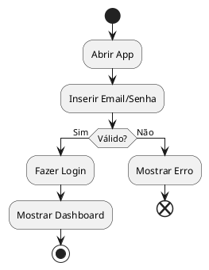
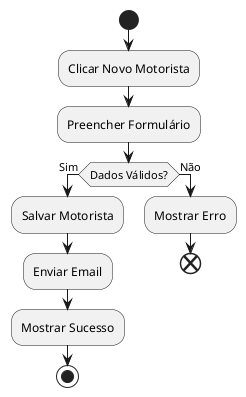
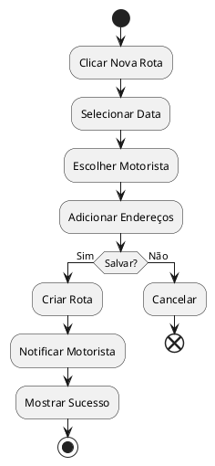
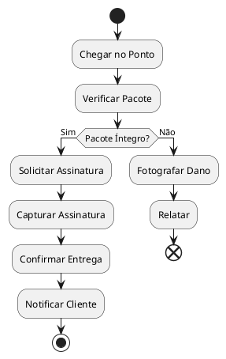
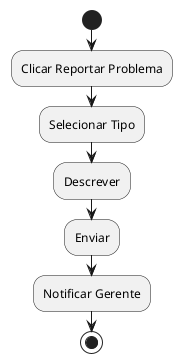
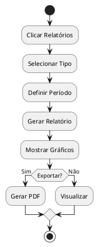
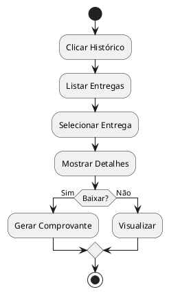
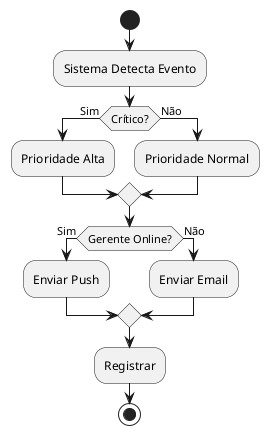

# 📋 Documentação dos Casos de Uso

---

## UC01 — Autenticar Usuário

**Ator(es):** Motorista, Gerente

**Descrição:** O usuário faz login no sistema com email e senha.

**Pré-condições:**
- Usuário possui conta criada

**Pós-condições:**
- Usuário está logado
- Dashboard é exibido

**Fluxo Principal:**
1. Usuário abre app
2. Insere email e senha
3. Sistema valida credenciais
4. Sistema mostra dashboard

**Fluxos Alternativos / Exceções:**
- FA01 — Senha incorreta: Sistema exibe erro
- FA02 — Sem internet: Sistema mostra alerta

**Relacionamentos:**
- Include: Validar Credenciais
- Extend: Recuperar Senha

**Diagrama:**


---

## UC02 — Cadastrar Motorista

**Ator(es):** Gerente

**Descrição:** Gerente adiciona um novo motorista ao sistema.

**Pré-condições:**
- Gerente está logado

**Pós-condições:**
- Motorista foi cadastrado
- Email enviado ao motorista

**Fluxo Principal:**
1. Gerente clica em "Novo Motorista"
2. Preenche dados (nome, CPF, telefone)
3. Insere dados da CNH
4. Clica em confirmar
5. Sistema salva motorista

**Fluxos Alternativos / Exceções:**
- FA01 — CPF duplicado: Sistema avisa
- FA02 — Campo vazio: Sistema mostra aviso

**Relacionamentos:**
- Include: Validar Dados
- Extend: Enviar Email

**Diagrama:**


---

## UC03 — Criar Rota de Entrega

**Ator(es):** Gerente

**Descrição:** Gerente cria uma nova rota de entrega.

**Pré-condições:**
- Gerente está logado
- Motorista cadastrado existe

**Pós-condições:**
- Rota foi criada
- Motorista foi notificado

**Fluxo Principal:**
1. Gerente clica em "Nova Rota"
2. Seleciona data da rota
3. Escolhe o motorista
4. Adiciona pontos de entrega (endereço)
5. Clica em confirmar
6. Sistema cria a rota

**Fluxos Alternativos / Exceções:**
- FA01 — Motorista sem disponibilidade: Sistema sugere outro
- FA02 — Erro de salvar: Sistema tenta novamente

**Relacionamentos:**
- Include: Associar Motorista
- Extend: Otimizar Rota

**Diagrama:**


---

## UC04 — Acompanhar Rota em Tempo Real

**Ator(es):** Gerente, Motorista

**Descrição:** Gerente e motorista veem a localização em tempo real durante a rota.

**Pré-condições:**
- Rota foi criada
- Motorista iniciou a rota
- GPS ativado

**Pós-condições:**
- Posição é atualizada
- Histórico da rota é salvo

**Fluxo Principal:**
1. Motorista inicia rota
2. GPS ativa e envia posição
3. Gerente vê mapa com motorista
4. Posição atualiza a cada 30 segundos
5. Motorista vê próximo ponto

**Fluxos Alternativos / Exceções:**
- FA01 — GPS desativado: Sistema alerta
- FA02 — Sem internet: Tenta reconectar

**Relacionamentos:**
- Include: Obter Localização GPS
- Extend: Alertar Desvio

**Diagrama:**
```plantuml
@startuml UC04
start
:Motorista Inicia Rota;
:Ativar GPS;
repeat
  :Enviar Localização;
  :Atualizar Mapa;
  :Aguardar 30s;
until (Rota Finalizada?)
  :Salvar Histórico;
  stop
@enduml
```

---

## UC05 — Registrar Entrega

**Ator(es):** Motorista

**Descrição:** Motorista confirma entrega no local, capturando assinatura.

**Pré-condições:**
- Motorista chegou no ponto
- Pacote está disponível

**Pós-condições:**
- Entrega registrada
- Cliente notificado

**Fluxo Principal:**
1. Motorista chega no endereço
2. Sistema mostra detalhes da entrega
3. Motorista verifica pacote
4. Solicita assinatura do cliente
5. Captura assinatura
6. Confirma entrega

**Fluxos Alternativos / Exceções:**
- FA01 — Cliente não encontrado: Registra tentativa
- FA02 — Pacote danificado: Fotografa e relata

**Relacionamentos:**
- Include: Capturar Assinatura
- Extend: Fotografar Evidência

**Diagrama:**


---

## UC06 — Reporte de Problemas

**Ator(es):** Motorista

**Descrição:** Motorista reporta problemas durante a rota.

**Pré-condições:**
- Motorista em rota
- Problema identificado

**Pós-condições:**
- Problema registrado
- Gerente foi notificado

**Fluxo Principal:**
1. Motorista identifica problema
2. Clica em "Reportar Problema"
3. Seleciona tipo (acidente, trânsito, avaria)
4. Descreve o problema
5. Confirma envio
6. Sistema notifica gerente

**Fluxos Alternativos / Exceções:**
- FA01 — Sem internet: Salva localmente
- FA02 — Problema crítico: Notifica automaticamente

**Relacionamentos:**
- Include: Localizar Motorista
- Extend: Alertar Suporte

**Diagrama:**


---

## UC07 — Gerar Relatório

**Ator(es):** Gerente

**Descrição:** Gerente gera relatório de rotas e entregas.

**Pré-condições:**
- Gerente está logado
- Há dados registrados

**Pós-condições:**
- Relatório foi gerado
- Pode ser exportado em PDF

**Fluxo Principal:**
1. Gerente clica em "Relatórios"
2. Seleciona tipo (Rotas, Entregas)
3. Define período (data início e fim)
4. Clica em gerar
5. Sistema mostra gráficos e tabelas

**Fluxos Alternativos / Exceções:**
- FA01 — Sem dados: Sistema mostra mensagem
- FA02 — Exportar: Gera PDF e baixa

**Relacionamentos:**
- Include: Coletar Dados
- Extend: Exportar PDF

**Diagrama:**


---

## UC08 — Atualizar Localização

**Ator(es):** Motorista, Sistema

**Descrição:** Sistema atualiza localização do motorista continuamente.

**Pré-condições:**
- Rota iniciada
- GPS ativo
- Internet disponível

**Pós-condições:**
- Posição salva no servidor
- Gerente vê em tempo real

**Fluxo Principal:**
1. Motorista inicia rota
2. GPS captura coordenadas
3. Sistema envia para servidor a cada 30s
4. Servidor armazena
5. Mapa atualiza com nova posição

**Fluxos Alternativos / Exceções:**
- FA01 — GPS desativado: Alerta motorista
- FA02 — Sem internet: Armazena e envia depois

**Relacionamentos:**
- Include: Capturar GPS
- Extend: Modo Econômico

**Diagrama:**
```plantuml
@startuml UC08
start
:Iniciar Rota;
repeat
  :Capturar GPS;
  if (Internet?) then (Sim)
    :Enviar Posição;
  else (Não)
    :Armazenar Local;
  endif
  :Atualizar Mapa;
  :Aguardar 30s;
until (Rota Finalizada?)
  stop
@enduml
```

---

## UC09 — Consultar Histórico

**Ator(es):** Motorista, Gerente

**Descrição:** Usuário consulta histórico de entregas passadas.

**Pré-condições:**
- Usuário está logado
- Há entregas registradas

**Pós-condições:**
- Histórico exibido
- Detalhes acessados

**Fluxo Principal:**
1. Usuário clica em "Histórico"
2. Sistema lista entregas
3. Usuário seleciona uma entrega
4. Sistema mostra detalhes e assinatura
5. Usuário pode visualizar/baixar comprovante

**Fluxos Alternativos / Exceções:**
- FA01 — Sem entregas: Mensagem de vazio
- FA02 — Comprovante corrompido: Mostra aviso

**Relacionamentos:**
- Include: Filtrar Histórico
- Extend: Baixar Comprovante

**Diagrama:**


---

## UC10 — Notificar Alertas

**Ator(es):** Sistema, Gerente

**Descrição:** Sistema envia notificações importantes ao gerente.

**Pré-condições:**
- Evento ocorreu (problema, atraso, etc)
- Gerente permitiu notificações

**Pós-condições:**
- Notificação foi entregue
- Gerente pode agir

**Fluxo Principal:**
1. Sistema detecta evento
2. Avalia críticidade
3. Envia notificação push
4. Gerente recebe
5. Clica na notificação
6. Sistema abre contexto

**Fluxos Alternativos / Exceções:**
- FA01 — Gerente offline: Envia email
- FA02 — Erro de envio: Tenta novamente

**Relacionamentos:**
- Include: Detectar Evento
- Extend: Enviar Email

**Diagrama:**


---

## 📊 Resumo

| UC | Nome | Ator |
|---|---|---|
| UC01 | Autenticar | Motorista, Gerente |
| UC02 | Cadastrar Motorista | Gerente |
| UC03 | Criar Rota | Gerente |
| UC04 | Acompanhar Rota | Gerente, Motorista |
| UC05 | Registrar Entrega | Motorista |
| UC06 | Reporte | Motorista |
| UC07 | Relatório | Gerente |
| UC08 | Atualizar Localização | Motorista, Sistema |
| UC09 | Histórico | Motorista, Gerente |
| UC10 | Notificar | Sistema, Gerente |
